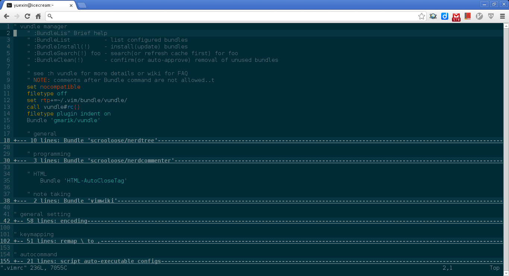
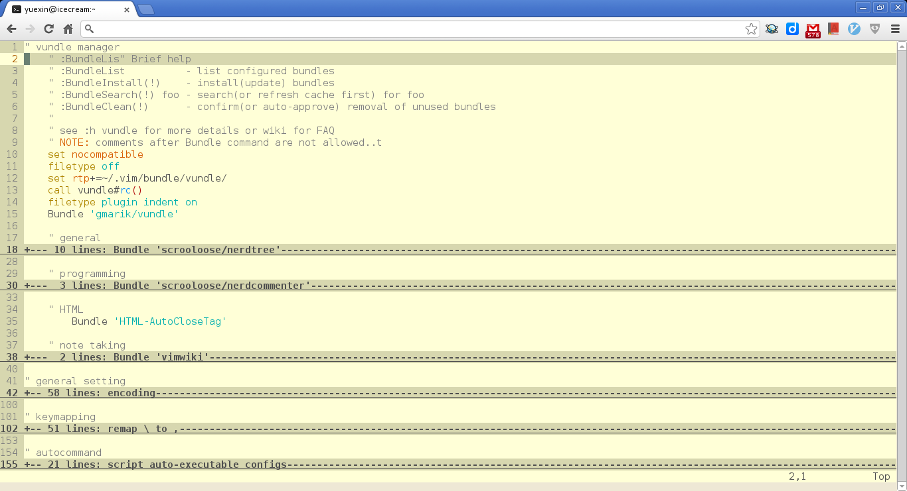

# Chrome Secure Shell Solarized

Basicly, it's configuration is similar with Terminator. But I did'nt
locate the exact position of its configuration files. So I wrote a
config file. Althougle it won't config the secure shell itself, you
can do some copy-and-paste work, to make secure shell have a
solarized color scheme. This is not a perfect solutioin. But more
or less it eases some burden

# Usage

1. open a new tab in chrome and switch to app page
2. right-click on the secure shell icon
3. left-click `options`
4. enter the values needed. Check config file or Scheme section below for details
5. open a new connection in secure shell, choose the profile u just edited/created

# Scheme

Same as in `config` file, for your ease, you can just copy from here.

    [solarized-dark]
        color-palette-override:
            {"0":"#073642","1":"#dc322f","2":"#859900","3":"#b58900","4":"#268bd2","5":"#d33682","6":"#2aa198","7":"#eee8d5","8":"#002b36","9":"#cb4b16","10":"#586e75","11":"#657b83","12":"#839496","13":"#6c71c4","14":"#93a1a1","15":"#fdf6e3"}
        background-color : "#002b36" //R:0 G:43 B:54
        cursor-color     : "#eee8d5" //R:238 G:232 B:213
        foreground-color : "#eee8d5" //R:238 G:232 B:213
        
    [solarized-light]
        color-palette-override:
            {"0":"#073642","1":"#dc322f","2":"#859900","3":"#b58900","4":"#268bd2","5":"#d33682","6":"#2aa198","7":"#eee8d5","8":"#002b36","9":"#cb4b16","10":"#586e75","11":"#657b83","12":"#839496","13":"#6c71c4","14":"#93a1a1","15":"#fdf6e3"}
        background_color : "#eee8d5" //R:238 G:232 B:213
        cursor_color     : "#002b36" //R:0 G:43 B:54
        foreground_color : "#002b36" //R:0 G:43 B:54

# Screen Shots

## solarized-dark

## solarized-light

